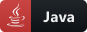

<h1 align="center">
    Hi there 👋 and welcome to my Git!   
</h1>

Profile is still under constructions, be patient please :) 

    
 
  

  <!-- For more icons please follow  https://github.com/MikeCodesDotNET/ColoredBadges -->
   
  
  
    
    

<!--
**Achellous/Achellous** is a ✨ _special_ ✨ repository because its `README.md` (this file) appears on your GitHub profile.

Here are some ideas to get you started:

- 🔭 I’m an Application-Developer i work mainly with (Java)
- 🌱 I’m currently learning: Java, Python, Smalltalk

- 📫 How to reach me: Fawaz.thomas.bo@gmail.com
- 😄 Pronouns: We/Us
- ⚡ Fun fact: After the rain comes the sun and after the sun comes the rain again! 

-->
        
 

        

